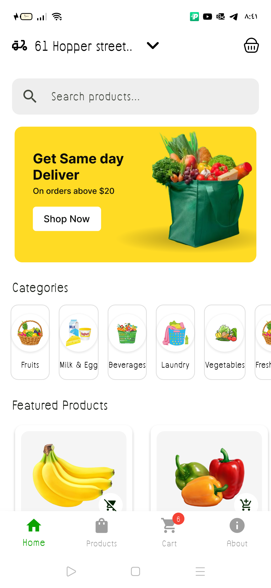

# 3MCode Shop

<p align="center">
  
</p>

<p align="center">
  <a href="#features">المميزات</a> •
  <a href="#screenshots">لقطات الشاشة</a> •
  <a href="#architecture">الهيكل المعماري</a> •
  <a href="#installation">التثبيت</a> •
  <a href="#documentation">التوثيق</a> •
  <a href="#roadmap">خارطة الطريق</a> •
  <a href="#license">الترخيص</a>
</p>

<p align="center">
  
  
  
  
</p>

## نظرة عامة

**3MCode Shop** هو تطبيق متجر إلكتروني متكامل مبني باستخدام إطار عمل Flutter، ويهدف إلى توفير تجربة تسوق سلسة للمستخدمين عبر منصات متعددة. يتميز التطبيق بواجهة مستخدم عصرية وسهلة الاستخدام، مع دعم كامل للغتين العربية والإنجليزية، ويوفر وضعي التصميم الفاتح والداكن.

## <a id="features"></a>المميزات الرئيسية

### واجهة المستخدم
- ✅ واجهة مستخدم عصرية وسهلة الاستخدام
- ✅ دعم وضعي التصميم الفاتح والداكن
- ✅ تصميم متجاوب يعمل على مختلف أحجام الشاشات
- ✅ رسوم متحركة وتأثيرات بصرية لتحسين تجربة المستخدم

### التعريب والترجمة
- ✅ دعم كامل للغتين العربية والإنجليزية
- ✅ تغيير اللغة بسهولة من خلال إعدادات التطبيق
- ✅ دعم اتجاه النص من اليمين إلى اليسار (RTL) للغة العربية

### المنتجات والتصنيفات
- ✅ عرض المنتجات في تصنيفات مختلفة
- ✅ البحث عن المنتجات وتصفيتها
- ✅ عرض تفاصيل المنتج مع الصور والأسعار والتقييمات
- ✅ إضافة المنتجات إلى المفضلة ومشاهدتها

### سلة التسوق
- ✅ إضافة المنتجات إلى سلة التسوق
- ✅ تعديل كمية المنتجات في السلة
- ✅ إزالة المنتجات من السلة
- ✅ حساب المجموع الفرعي والضرائب ورسوم الشحن

### الدفع والطلبات
- ✅ إتمام عملية الشراء مع خيارات دفع متعددة
- ✅ عرض تأكيد الطلب ورقم التتبع
- ✅ عرض سجل الطلبات السابقة وتفاصيلها

### الحسابات والملفات الشخصية
- ✅ تسجيل الدخول وإنشاء حساب جديد
- ✅ تعديل معلومات الملف الشخصي
- ✅ عرض سجل الطلبات والعناوين المحفوظة

## <a id="screenshots"></a>لقطات الشاشة

<div align="center">
  
  <!-- يمكن إضافة المزيد من لقطات الشاشة هنا -->
</div>

## <a id="architecture"></a>الهيكل المعماري

يتبع المشروع نمط هندسة معمارية نظيفة (Clean Architecture) مع تطبيق مبدأ فصل المسؤوليات، حيث يتم تقسيم التطبيق إلى ثلاث طبقات رئيسية:

1. **طبقة العرض (Presentation Layer)**: تتضمن واجهات المستخدم والمكونات المرئية وإدارة حالة التطبيق باستخدام BLoC.
2. **طبقة المنطق (Domain Layer)**: تتضمن منطق الأعمال والقواعد الخاصة بالتطبيق.
3. **طبقة البيانات (Data Layer)**: تتضمن مصادر البيانات والنماذج والمستودعات.

لمزيد من التفاصيل، يرجى الاطلاع على [وثيقة الهيكل المعماري](ARCHITECTURE.md).

## <a id="installation"></a>التثبيت

### المتطلبات الأساسية

- Flutter SDK (الإصدار 3.19.3 أو أحدث)
- Dart SDK (الإصدار 3.7.2 أو أحدث)
- Android Studio / VS Code
- جهاز أو محاكي Android / iOS

### خطوات التثبيت

1. استنساخ المستودع:
   ```bash
   git clone https://github.com/yourusername/app_3mcode_shop.git
   cd app_3mcode_shop
   ```

2. تثبيت التبعيات:
   ```bash
   flutter pub get
   ```

3. تشغيل التطبيق:
   ```bash
   flutter run
   ```

## <a id="documentation"></a>التوثيق

للحصول على معلومات مفصلة حول المشروع، يرجى الاطلاع على الوثائق التالية:

- [الهيكل المعماري](ARCHITECTURE.md): تفاصيل حول هيكل المشروع ونمط الهندسة المعمارية.
- [إرشادات واجهة المستخدم](UI_GUIDELINES.md): إرشادات وقواعد تصميم واجهة المستخدم.
- [إدارة الحالة](STATE_MANAGEMENT.md): تفاصيل حول كيفية إدارة حالة التطبيق باستخدام BLoC.
- [دليل المساهمة](CONTRIBUTING.md): إرشادات للمساهمين في المشروع.

## <a id="roadmap"></a>خارطة الطريق

لمعرفة الخطط المستقبلية للمشروع والميزات القادمة، يرجى الاطلاع على [خارطة الطريق](ROADMAP.md).

## <a id="license"></a>الترخيص

هذا المشروع مرخص بموجب [رخصة MIT](LICENSE).

## الاتصال

للاستفسارات أو الاقتراحات، يرجى التواصل عبر:

- البريد الإلكتروني: support@3mcode-shop.com
- الموقع الإلكتروني: [www.3mcode-shop.com](https://www.3mcode-shop.com)

---

<p align="center">
  تم التطوير بواسطة <a href="https://www.3mcode.com">3MCode</a> - جميع الحقوق محفوظة © 2025
</p>
