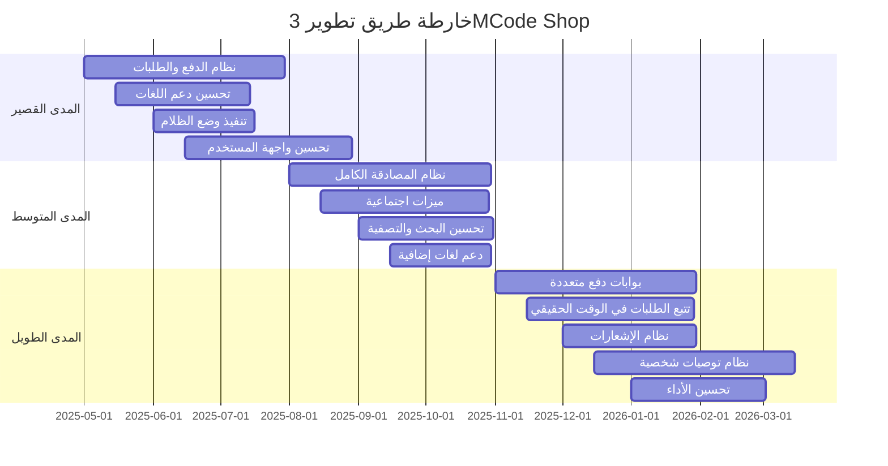

# خارطة الطريق المستقبلية لتطبيق 3MCode Shop

  

  <a href="#current-status">الوضع الحالي</a> •
  <a href="#short-term">المدى القصير (1-3 أشهر)</a> •
  <a href="#mid-term">المدى المتوسط (4-6 أشهر)</a> •
  <a href="#long-term">المدى الطويل (7-12 أشهر)</a> •
  <a href="#future-vision">الرؤية المستقبلية</a>

## الوضع الحالي

تطبيق 3MCode Shop حاليًا في مرحلة التطوير النشط، مع تنفيذ المميزات الأساسية التالية:

### المميزات المنفذة

- ✅ واجهة مستخدم عصرية وسهلة الاستخدام
- ✅ دعم اللغتين العربية والإنجليزية
- ✅ دعم وضعي التصميم الفاتح والداكن
- ✅ عرض المنتجات والتصنيفات
- ✅ البحث عن المنتجات وتصفيتها
- ✅ إدارة سلة التسوق (إضافة، إزالة، تعديل الكمية)
- ✅ إدارة المفضلة (إضافة، إزالة، عرض المنتجات المفضلة)
- ✅ تخزين البيانات محليًا

### المميزات قيد التطوير

- 🔄 صفحات الدفع وتأكيد الطلب
- 🔄 نظام المصادقة وإدارة الحسابات
- 🔄 تحسين تجربة المستخدم والأداء

## المدى القصير (1-3 أشهر)

### الأهداف

1. **إكمال نظام الدفع والطلبات**
   - تنفيذ صفحة الدفع مع خيارات متعددة
   - تنفيذ صفحة تأكيد الطلب
   - إضافة دعم الدفع عند الاستلام والدفع المحلي
   - تنفيذ صفحة تتبع الطلبات

2. **تحسين دعم اللغات**
   - تحسين دعم اللغة العربية والإنجليزية
   - إضافة المزيد من النصوص المترجمة
   - تحسين دعم RTL في جميع أنحاء التطبيق

3. **تنفيذ وضع الظلام بشكل كامل**
   - تحسين تجربة وضع الظلام
   - إضافة خيار التبديل التلقائي حسب إعدادات النظام
   - تحسين التباين والقراءة في وضع الظلام

4. **تحسين واجهة المستخدم وتجربة المستخدم**
   - إضافة رسوم متحركة وتأثيرات بصرية
   - تحسين سرعة التحميل والاستجابة
   - تحسين تجربة المستخدم في الأجهزة المختلفة

### المهام المحددة

| المهمة | الأولوية | التقدم |
|-------|---------|--------|
| تنفيذ صفحة الدفع | عالية | 🔄 قيد التنفيذ |
| تنفيذ صفحة تأكيد الطلب | عالية | 🔄 قيد التنفيذ |
| إضافة دعم الدفع عند الاستلام | عالية | 📅 مخطط |
| تحسين دعم اللغة العربية | متوسطة | 🔄 قيد التنفيذ |
| تحسين وضع الظلام | متوسطة | 📅 مخطط |
| إضافة رسوم متحركة للمكونات | منخفضة | 📅 مخطط |

## المدى المتوسط (4-6 أشهر)

### الأهداف

1. **تنفيذ نظام المصادقة الكامل**
   - تسجيل الدخول وإنشاء حساب جديد
   - إدارة الملف الشخصي
   - استعادة كلمة المرور
   - المصادقة باستخدام وسائل التواصل الاجتماعي

2. **تحسين ميزات اجتماعية**
   - تحسين قائمة المفضلة وتجربة المستخدم
   - تقييمات ومراجعات المنتجات
   - مشاركة المنتجات عبر وسائل التواصل الاجتماعي

3. **تحسين نظام البحث والتصفية**
   - بحث متقدم مع اقتراحات
   - تصفية متعددة المعايير
   - فرز النتائج حسب معايير مختلفة

4. **إضافة دعم لغات إضافية**
   - إضافة دعم للغات أخرى
   - تحسين نظام الترجمة

### المهام المحددة

| المهمة | الأولوية | التقدم |
|-------|---------|--------|
| تنفيذ نظام تسجيل الدخول | عالية | 📅 مخطط |
| تنفيذ نظام إنشاء حساب جديد | عالية | 📅 مخطط |
| إضافة استعادة كلمة المرور | متوسطة | 📅 مخطط |
| إضافة المصادقة الاجتماعية | منخفضة | 📅 مخطط |
| تحسين قائمة المفضلة | متوسطة | ✅ منفذ جزئياً |
| إضافة تقييمات ومراجعات | متوسطة | 📅 مخطط |
| تحسين نظام البحث | عالية | 📅 مخطط |
| إضافة لغات جديدة | منخفضة | 📅 مخطط |

## المدى الطويل (7-12 أشهر)

### الأهداف

1. **إضافة بوابات دفع متعددة**
   - دعم PayPal
   - دعم بطاقات الائتمان
   - دعم Apple Pay و Google Pay
   - دعم المحافظ الإلكترونية المحلية

2. **تنفيذ نظام تتبع الطلبات في الوقت الحقيقي**
   - تتبع حالة الطلب
   - إشعارات تحديث الحالة
   - خريطة لتتبع التوصيل

3. **إضافة نظام الإشعارات**
   - إشعارات الطلبات
   - إشعارات العروض والتخفيضات
   - إشعارات المنتجات الجديدة
   - إشعارات مخصصة

4. **تنفيذ نظام توصيات شخصية**
   - توصيات بناءً على سلوك المستخدم
   - منتجات مشابهة
   - منتجات يشتريها الناس معًا

5. **تحسين الأداء وتجربة المستخدم**
   - تحسين سرعة التحميل
   - تحسين استهلاك الموارد
   - دعم وضع عدم الاتصال

### المهام المحددة

| المهمة | الأولوية | التقدم |
|-------|---------|--------|
| دعم PayPal | عالية | 📅 مخطط |
| دعم بطاقات الائتمان | عالية | 📅 مخطط |
| دعم Apple Pay و Google Pay | متوسطة | 📅 مخطط |
| تنفيذ تتبع الطلبات | عالية | 📅 مخطط |
| إضافة خريطة التتبع | متوسطة | 📅 مخطط |
| تنفيذ نظام الإشعارات | عالية | 📅 مخطط |
| إضافة توصيات شخصية | متوسطة | 📅 مخطط |
| تحسين الأداء | عالية | 📅 مخطط |
| دعم وضع عدم الاتصال | منخفضة | 📅 مخطط |

## الرؤية المستقبلية

### التوسع في المنصات

- **تطبيق الويب**: تطوير نسخة ويب كاملة من التطبيق
- **تطبيق سطح المكتب**: دعم أنظمة Windows و macOS و Linux
- **تطبيق الساعات الذكية**: دعم Apple Watch و Wear OS

### ميزات متقدمة

1. **الواقع المعزز (AR)**
   - عرض المنتجات في البيئة الحقيقية
   - قياس الأبعاد والحجم
   - تجربة المنتجات افتراضيًا

2. **التعلم الآلي والذكاء الاصطناعي**
   - توصيات ذكية للمنتجات
   - تحليل سلوك المستخدم
   - تحسين تجربة المستخدم بناءً على البيانات

3. **التكامل مع الأنظمة الأخرى**
   - التكامل مع أنظمة إدارة المخزون
   - التكامل مع أنظمة المحاسبة
   - التكامل مع أنظمة إدارة علاقات العملاء

4. **برنامج الولاء والمكافآت**
   - نقاط الولاء
   - الكوبونات والخصومات
   - العروض الخاصة للأعضاء

### التوسع في الأسواق

- **دعم المزيد من اللغات**: توسيع نطاق اللغات المدعومة
- **دعم المزيد من العملات**: إضافة دعم للعملات المختلفة
- **دعم المزيد من المناطق**: توسيع نطاق التوصيل والشحن

## مخطط التطوير

## ملاحظات ختامية

تعتبر خارطة الطريق هذه وثيقة حية قابلة للتغيير والتطوير بناءً على احتياجات المستخدمين وتطورات السوق والتقنيات الجديدة. سيتم تحديث هذه الوثيقة بشكل دوري لتعكس التقدم المحرز والتغييرات في الأولويات.

نرحب بالاقتراحات والملاحظات من المستخدمين والمطورين لتحسين التطبيق وإضافة ميزات جديدة تلبي احتياجاتهم.

---

  تم التطوير بواسطة <a href="https://www.3mcode.com">3MCode</a> - جميع الحقوق محفوظة © 2025

